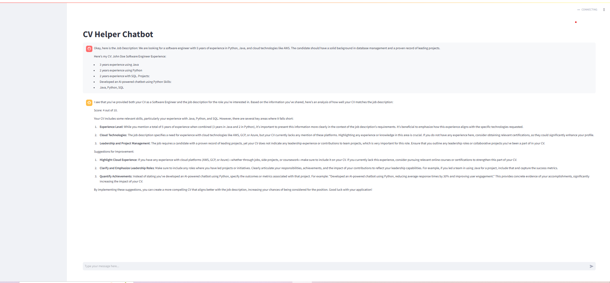

# CV-Helper

This project provides a chatbot that helps users assess how well their CV matches a given job description. The chatbot provides a score and actionable suggestions to help users improve their CVs.



## Features

- **CV Analysis:** Analyzes a user's CV against a job description.
- **Scoring:** Provides a score out of 10, reflecting the CV's alignment with the job description.
- **Actionable Suggestions:** Gives 2-3 specific suggestions for improving the CV.
- **Conversational Interface:** Supports a natural, conversational interaction with the user.
- **Memory:** The chatbot remembers previous interactions and uses them to keep the conversation fluid and contextual.
- **Easy-to-use Streamlit Interface:** The chatbot is deployed using Streamlit, making it easy to use through your browser.
- **Docker Support:** Can be easily containerized and run using Docker.

## Getting Started

### Prerequisites

- **Python 3.11+**
- **uv** - An extremely fast Python package manager written in Rust.
- **Git** - For version control.
- **Docker** - For containerization (if using the Docker approach).
- **A valid OpenAI API key:** You will need an API key to run the LLM, which should be defined in a `.env` file or as environment variables (if using Docker).

### Installation

You can install and run this application using one of two approaches: **with a virtual environment** or **with Docker.** Choose the one that best suits your needs.

1.  **Clone the repository:**

    ```bash
    git clone https://github.com/achrafib1/CV-Helper
    cd CV-Helper
    ```

#### Method 1: Using a Virtual Environment (Recommended for Development)

1.  **Set up a virtual environment:** We recommend using virtual environments for your projects. Choose one of the following methods:

    - **Using `uv` (Cross-Platform, Recommended for faster performance):**

      ```bash
      uv venv --python 3.11
      ```

      We recommend `uv` for creating virtual environments for faster performance. `uv` is an extremely fast Python package and project manager written in Rust. For more details on installing `uv`, please refer to the [official uv installation guide](https://docs.astral.sh/uv/getting-started/installation/).

    - **Using Python's built-in `venv` (Cross-Platform):**
      ```bash
      python -m venv .venv
      ```
      This is a more standard way of creating virtual environments using python's built-in tools, and does not require any additional installation.

2.  **Activate the virtual environment and install dependencies:**

    - **If using `uv`:**
      - **Linux/macOS:**
        ```bash
        source .venv/bin/activate
        uv pip install -r requirements.txt
        ```
      - **Windows:**
        ```bash
        .venv\Scripts\activate
        uv pip install -r requirements.txt
        ```
      - **Verify installation:**
        ```bash
        uv pip check
        ```
    - **If using `venv`:**
      - **Linux/macOS:**
        ```bash
        source .venv/bin/activate
        pip install -r requirements.txt
        ```
      - **Windows:**
        ```bash
        .venv\Scripts\activate
        pip install -r requirements.txt
        ```
    - **Verify installation:**

      ```bash
       pip check

      ```

    - **Ensure that the `requirements.txt` file exists at the root of your project and contains the list of all required dependencies.**

3.  **Set up a `.env` file:**

    - Create a `.env` file in the project root directory.
    - Add the model name you'd like to use like so:

      ```
      MODEL=gpt-4o-mini
      ```

    - Add your OpenAI API key to the file like so:
      ```
      OPENAI_API_KEY=sk-your-openai-api-key
      ```
      - Replace `sk-your-openai-api-key` with the API Key for your OpenAI account.

#### Method 2: Using Docker (Recommended for Ease of Deployment)

This method is simpler if you have Docker installed, as it bundles the application and its dependencies into a container. **Note that you must build the Docker image locally from the project's files as we are not providing a pre-built image from a registry.**

1.  **Ensure you have Docker installed:** If you do not have Docker installed, follow the instructions on the [Docker website](https://docs.docker.com/get-docker/).

2.  **Build the Docker image:**
    ```bash
    docker build -t cv-helper .
    ```
    This command builds a Docker image named `cv-helper` using the `Dockerfile` present in the current directory. **Make sure to run this command from the root of the cloned repository, where the `Dockerfile` is located.**

### Running the Application

After completing the installation steps based on your chosen approach, follow the corresponding instructions below to run the application.

#### Method 1: Running with Virtual Environment

1.  **Run the main app:**

    - **Linux/macOS:**
      ```bash
      streamlit run src/app.py
      ```
    - **Windows:**

      ```bash
      streamlit run src\app.py
      ```

      This will start the Streamlit application in your default web browser. You can interact with the chatbot from the interface.

#### Method 2: Running with Docker

```bash
docker run -d -p 8501:8501  -e MODEL="gpt-4o-mini"  -e OPENAI_API_KEY="sk-your-openai-api-key" cv-helper
```

- `-d`: Runs the container in detached mode (in the background).
- `-p 8501:8501`: Maps port 8501 on your host machine to port 8501 on the container, which is where the Streamlit app runs.
- `-e MODEL="gpt-4o-mini"`: Sets the environment variable `MODEL` to the value `gpt-4o-mini` inside the Docker container.
- `-e OPENAI_API_KEY="sk-your-openai-api-key"`: Sets the environment variable `OPENAI_API_KEY` to the value you want inside the Docker container. **Remember to replace `sk-your-openai-api-key` with your actual OpenAI API key.**
- `cv-helper`: Specifies the name of the Docker image to run.

**Note:** When running the Docker container, instead of passing environment variables directly as shown above, you can also mount a `.env` file into the container. If you choose this approach, create a `.env` file in your root directory with your configurations and mount this file using the following command structure:

```bash
    docker run -d -p 8501:8501 --env-file .env cv-helper
```

When using this command, the `-e` flag is not required, all the required environemnt varibles are passed from the `.env` file that you created.

The Streamlit application will be available at `http://localhost:8501` in your browser.

### Example Usage

**User Input:**

```

Here is the Job Description: We are looking for a skilled software engineer with 5+ years of experience in Python, a strong background in cloud technologies, and excellent communication skills. The ideal candidate will have experience with agile development methodologies and be a team player.

Here is my CV: John Doe
Software Engineer
Summary
A highly skilled software engineer with experience in developing and maintaining Python applications. Expert in Python, with a good understanding of cloud platforms such as AWS, and possess basic communication skills.

Experience
Software Engineer at Tech Solutions, 2018 – Present.
Developed and maintained several Python applications for cloud and on-premise deployment.

Education
Master of Science in Computer Science, University X, 2018.
Bachelor of Science in Computer Science, University X, 2016.

```

**Expected Bot Output (Example):**

```

I see that you've provided both your CV as a Software Engineer and the job description for the role you're interested in. Based on the information you've shared, here’s an analysis of how well your CV matches the job description:

Score: 5 out of 10.

Your CV demonstrates relevant experience, particularly in Python, but there are several areas for improvement:

1. Experience Requirement: The job description requires over five years of experience in software development, specifically mentioning Python. Your CV explicitly states experience in developing Python applications, which is good. However, it would be beneficial to highlight the exact number of years you have worked with Python, especially if it exceeds five years.

2. Cloud Technologies: While you mention a good understanding of cloud platforms like AWS, the job description emphasizes a strong background in cloud technologies. Provide specific examples of how you've utilized these cloud technologies in past projects to strengthen your application.

3. Communication Skills: The job seeks candidates with excellent communication skills. Your CV notes only basic communication skills. To align closely with the job description, you may want to illustrate experiences where you effectively communicated complex technical concepts to non-technical stakeholders or collaborated closely with team members.

Suggestions for Improvement:

1. Detail Your Experience: Specify the number of years you have worked with Python. For example, instead of saying "experience in developing Python applications," say "over 5 years of experience developing and maintaining Python applications, focusing on scalability and performance optimization."

2. Showcase Cloud Experience: If you have specific projects where you utilized AWS or other cloud technologies, clearly detail them. For instance, "Implemented a cloud-based solution on AWS that improved system reliability and reduced costs by 20%."

3. Enhance Communication Skills Section: Add concrete examples that demonstrate strong communication skills. You might say, "Presented project updates to stakeholders, ensuring clarity in technical discussions, which led to increased project understanding and stakeholder confidence."

By addressing these suggestions, you can create a more compelling CV that aligns better with the job description and enhances your candidacy for the software engineer position. Good luck with your application!

```

## Contributing

Contributions to this project are welcome. Please follow these guidelines:

1.  **Fork:** Fork the repository.
2.  **Branch:** Create a feature branch for your contribution.
3.  **Commit:** Make your changes and commit them using clear, well-formatted messages.
4.  **Pull Request:** Submit a pull request with your changes.

## License

This project is licensed under the MIT License - see the [LICENSE](LICENSE.md) file for details.
